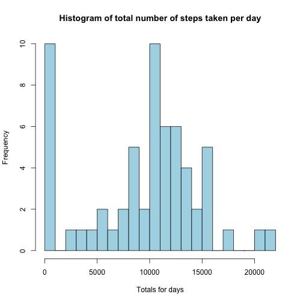
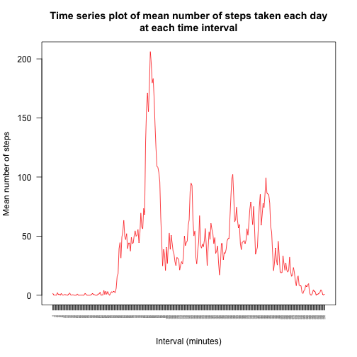
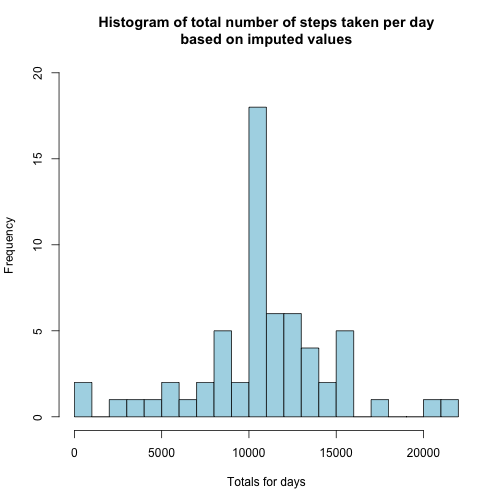
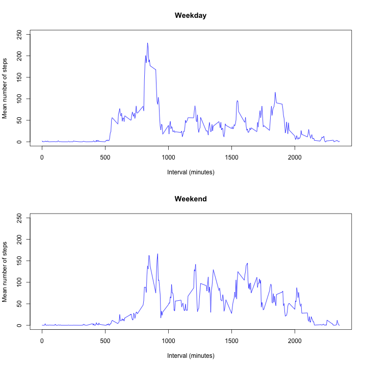

Peer Assessment 1 - Reproducible research
========================================================
  
  
>PART 1. WHAT IS THE MEAN NUMBER OF STEPS TAKEN PER DAY?  
  
**Make a histogram of the total number of steps taken each day**

```r
  library(knitr)
  library(markdown)
  wanted <- read.csv('activity.csv', header=T) #colnames = steps, date, interval

  #Remove the missing values from the data set
  steps <- wanted[!is.na(wanted$steps),]

  steps.days <- split(steps$steps, steps$date)

  day.total.steps <- lapply(steps.days, FUN=sum)
  day.total.steps <- unlist(day.total.steps)
  hist(day.total.steps, breaks=20, main='Histogram of total number of steps taken per day', ylim=c(0, 10), xlab='Totals for days', col='lightblue')
```

 

**Mean and median total number of steps taken per day**

```r
  mean.days <- lapply(steps.days, FUN=mean, na.rm=T)
  median.days <- lapply(steps.days, FUN=median, na.rm=T)
  mean.days <- unlist(mean.days)
  median.days <- unlist(median.days)
  out <-data.frame(Mean=mean.days, Median=median.days)
  out
```

```
##               Mean Median
## 2012-10-01     NaN     NA
## 2012-10-02  0.4375      0
## 2012-10-03 39.4167      0
## 2012-10-04 42.0694      0
## 2012-10-05 46.1597      0
## 2012-10-06 53.5417      0
## 2012-10-07 38.2465      0
## 2012-10-08     NaN     NA
## 2012-10-09 44.4826      0
## 2012-10-10 34.3750      0
## 2012-10-11 35.7778      0
## 2012-10-12 60.3542      0
## 2012-10-13 43.1458      0
## 2012-10-14 52.4236      0
## 2012-10-15 35.2049      0
## 2012-10-16 52.3750      0
## 2012-10-17 46.7083      0
## 2012-10-18 34.9167      0
## 2012-10-19 41.0729      0
## 2012-10-20 36.0938      0
## 2012-10-21 30.6285      0
## 2012-10-22 46.7361      0
## 2012-10-23 30.9653      0
## 2012-10-24 29.0104      0
## 2012-10-25  8.6528      0
## 2012-10-26 23.5347      0
## 2012-10-27 35.1354      0
## 2012-10-28 39.7847      0
## 2012-10-29 17.4236      0
## 2012-10-30 34.0938      0
## 2012-10-31 53.5208      0
## 2012-11-01     NaN     NA
## 2012-11-02 36.8056      0
## 2012-11-03 36.7049      0
## 2012-11-04     NaN     NA
## 2012-11-05 36.2465      0
## 2012-11-06 28.9375      0
## 2012-11-07 44.7326      0
## 2012-11-08 11.1771      0
## 2012-11-09     NaN     NA
## 2012-11-10     NaN     NA
## 2012-11-11 43.7778      0
## 2012-11-12 37.3785      0
## 2012-11-13 25.4722      0
## 2012-11-14     NaN     NA
## 2012-11-15  0.1424      0
## 2012-11-16 18.8924      0
## 2012-11-17 49.7882      0
## 2012-11-18 52.4653      0
## 2012-11-19 30.6979      0
## 2012-11-20 15.5278      0
## 2012-11-21 44.3993      0
## 2012-11-22 70.9271      0
## 2012-11-23 73.5903      0
## 2012-11-24 50.2708      0
## 2012-11-25 41.0903      0
## 2012-11-26 38.7569      0
## 2012-11-27 47.3819      0
## 2012-11-28 35.3576      0
## 2012-11-29 24.4688      0
## 2012-11-30     NaN     NA
```
  
  
>PART 2. WHAT IS THE AVERAGE ACTIVITY PATTERN?  
  
**Make a time series plot (i.e. type = "l") of the 5-minute interval (x-axis) and the average number of steps taken, averaged across all days (y-axis)**

```r
  intervals.days <- split(steps$steps, steps$interval)
  mean.intervals <- lapply(intervals.days, FUN=mean)
  mean.intervals <- unlist(mean.intervals)
  plot(mean.intervals, xaxt='n',type='l', col='red',
    ylab='Mean number of steps',
    xlab='Interval (minutes)',
	  main='Time series plot of mean number of steps taken each day\nat each time interval',
	  las=2)
  axis(1, at=seq(1:length(mean.intervals)), names(mean.intervals), las=2, cex.axis=0.2)
```

 
  
**Which 5-minute interval, on average across all the days in the dataset, contains the maximum number of steps?**  

```r
  names(mean.intervals[which(mean.intervals %in% max(mean.intervals))])
```

```
## [1] "835"
```
  
  
>PART 3. IMPUTING MISSING VALUES  
  
**What is the total number of rows containing NAs?**

```r
  #total number of rows containing NAs in data
  length(is.na(wanted$steps))
```

```
## [1] 17568
```
  
**Devise a strategy for filling in all of the missing values in the dataset.The strategy does not need to be sophisticated. For example, you could use the mean/median for that day, or the mean for that 5-minute interval, etc.  
Create a new dataset that is equal to the original dataset but with the missing data filled in.**

*I used the mean of the 5-minute interval for each interval*


```r
  intervals.days <- split(wanted$steps, wanted$interval)
  
  df <- data.frame(matrix(unlist(intervals.days), nrow=288, byrow=T))
  rownames(df) <- names(intervals.days)
  colnames(df) <- unique(wanted$date)
  
  #mean for that 5-minute interval
  #Create a new dataset that is equal to the original dataset but with the missing data filled in
  k <- which(is.na(df), arr.ind=TRUE)
  df[k] <- rowMeans(df, na.rm=TRUE)[k[,1]]
```

**Make a histogram of the total number of steps taken each day and calculate and report the mean and median total number of steps taken per day. Do these values differ from the estimates from the first part of the assignment? What is the impact of imputing missing data on the estimates of the total daily number of steps?**

```r
  hist(colSums(df), breaks=20, main='Histogram of total number of steps taken per day\nbased on imputed values', ylim=c(0, 20), xlab='Totals for days', col='lightblue')
```

 
  
Imputing values for missing data changes the shape of the histogram, with far fewer 0 values for the data. Including imputed missing values in the dataset increases the estimates of the total daily number of steps.

```r
  df.mean <- apply(df, 2, mean)
  df.median <- apply(df, 2, median)
  out.2 <- data.frame(Mean=df.mean, Median=df.median)
  out.2
```

```
##               Mean Median
## 2012-10-01 37.3826  34.11
## 2012-10-02  0.4375   0.00
## 2012-10-03 39.4167   0.00
## 2012-10-04 42.0694   0.00
## 2012-10-05 46.1597   0.00
## 2012-10-06 53.5417   0.00
## 2012-10-07 38.2465   0.00
## 2012-10-08 37.3826  34.11
## 2012-10-09 44.4826   0.00
## 2012-10-10 34.3750   0.00
## 2012-10-11 35.7778   0.00
## 2012-10-12 60.3542   0.00
## 2012-10-13 43.1458   0.00
## 2012-10-14 52.4236   0.00
## 2012-10-15 35.2049   0.00
## 2012-10-16 52.3750   0.00
## 2012-10-17 46.7083   0.00
## 2012-10-18 34.9167   0.00
## 2012-10-19 41.0729   0.00
## 2012-10-20 36.0938   0.00
## 2012-10-21 30.6285   0.00
## 2012-10-22 46.7361   0.00
## 2012-10-23 30.9653   0.00
## 2012-10-24 29.0104   0.00
## 2012-10-25  8.6528   0.00
## 2012-10-26 23.5347   0.00
## 2012-10-27 35.1354   0.00
## 2012-10-28 39.7847   0.00
## 2012-10-29 17.4236   0.00
## 2012-10-30 34.0938   0.00
## 2012-10-31 53.5208   0.00
## 2012-11-01 37.3826  34.11
## 2012-11-02 36.8056   0.00
## 2012-11-03 36.7049   0.00
## 2012-11-04 37.3826  34.11
## 2012-11-05 36.2465   0.00
## 2012-11-06 28.9375   0.00
## 2012-11-07 44.7326   0.00
## 2012-11-08 11.1771   0.00
## 2012-11-09 37.3826  34.11
## 2012-11-10 37.3826  34.11
## 2012-11-11 43.7778   0.00
## 2012-11-12 37.3785   0.00
## 2012-11-13 25.4722   0.00
## 2012-11-14 37.3826  34.11
## 2012-11-15  0.1424   0.00
## 2012-11-16 18.8924   0.00
## 2012-11-17 49.7882   0.00
## 2012-11-18 52.4653   0.00
## 2012-11-19 30.6979   0.00
## 2012-11-20 15.5278   0.00
## 2012-11-21 44.3993   0.00
## 2012-11-22 70.9271   0.00
## 2012-11-23 73.5903   0.00
## 2012-11-24 50.2708   0.00
## 2012-11-25 41.0903   0.00
## 2012-11-26 38.7569   0.00
## 2012-11-27 47.3819   0.00
## 2012-11-28 35.3576   0.00
## 2012-11-29 24.4688   0.00
## 2012-11-30 37.3826  34.11
```
  
  
>PART 4. ARE THERE DIFFERENCES IN ACTIVITY PATTERNS BETWEEN WEEKDAYS AND WEEKENDS?
  
**Create a new factor variable in the dataset with two levels 'weekday' and 'weekend' indicating whether a given date is a weekday or weekend day.**

```r
  df.t <- t(df)

  days <- weekdays(as.Date(rownames(df.t)))
  x <- grep('Sun|Sat', days)
  days[x] <- 'Weekend'
  y <- grep('day', days)
  days[y] <- 'Weekday'
  df.t <- data.frame(df.t, Days = days)
  day.we <- split(df.t, df.t$Days)

  weekday <- day.we[[1]]
  weekend <- day.we[[2]]
  x <- apply(weekday[,1:288], 2, mean) #weekday
  names(x) <- sub('X', '', names(x))
  y <- apply(weekend[,1:288], 2, mean) #weekend
  names(y) <- sub('X', '', names(y))
```
**Make a panel plot containing a time series plot (i.e. type = "l") of the 5-minute interval (x-axis) and the average number of steps taken, averaged across all weekday days or weekend days (y-axis).**

```r
  par(mfrow=c(2,1))
  plot(names(x), x, type='l', main='Weekday', ylim=c(0,250), xlab='Interval (minutes)', ylab='Mean number of steps', col='blue')
  plot(names(y), y, type='l', main='Weekend', ylim=c(0,250), xlab='Interval (minutes)', ylab='Mean number of steps', col='blue')
```

 
